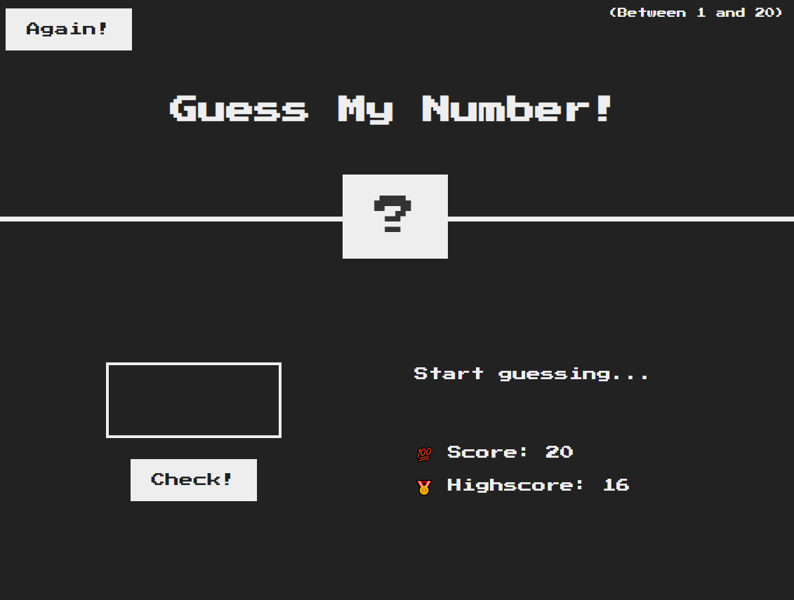

# Guessing-Game
A simple Guessing Game utilizing HTML, CSS and JavaScript. 

## Summary
Earlier this year I decided to delve into programming by learning JavaScript, HTML and CSS. I followed several online tutorials and even joined a Front-End Development Boot Camp. This is a step-by-step project I found online, but after completing this project I wanted to see if I could recreate it on my own. After several attempts I completed my first project. The feeling after finishing this project cemented my love for programming.
